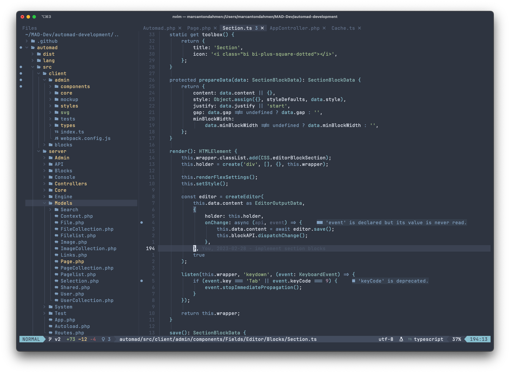

# Nvim Config




This is the personal NeoVim configuration of Marc Anton Dahmen.
It is based on [this YouTube tutorial](https://www.youtube.com/watch?v=vdn_pKJUda8)
and [this config](https://github.com/josean-dev/dev-environment-files/tree/main/.config/nvim).

## Included

This config includes the following plugins:

-   [alpha-nvim](https://github.com/goolord/alpha-nvim) dashboard
-   [auto-session](https://github.com/rmagatti/auto-session/) session manager
-   [Comment.nvim](https://github.com/numToStr/Comment.nvim) comment plugin
-   [diffview.nvim](https://github.com/sindrets/diffview.nvim) git diff view
-   [gitsigns.nvim](https://github.com/lewis6991/gitsigns.nvim) git status gutter
-   [indent-blankline.nvim](https://github.com/lukas-reineke/indent-blankline.nvim) indent guides
-   [lspsaga.nvim](https://github.com/glepnir/lspsaga.nvim) language server functions
-   [lualine.nvim](https://github.com/nvim-lualine/lualine.nvim) status line
-   [neogen](https://github.com/danymat/neogen) docblocks
-   [nord.nvim](https://github.com/gbprod/nord.nvim) color scheme
-   [null-ls.nvim](https://github.com/jose-elias-alvarez/null-ls.nvim) formatters
-   [nvim-autopairs](https://github.com/windwp/nvim-autopairs) auto pairing
-   [nvim-cmp](https://github.com/hrsh7th/nvim-cmp) autocompletion
-   [nvim-lspconfig](https://github.com/neovim/nvim-lspconfig) language server config
-   [nvim-navbuddy](https://github.com/SmiteshP/nvim-navbuddy) symbols navigation
-   [nvim-notify](https://github.com/rcarriga/nvim-notify) notifications
-   [nvim-spectre](https://github.com/nvim-pack/nvim-spectre) project wide search and replace
-   [nvim-tree.lua](https://github.com/nvim-tree/nvim-tree.lua) file explorer
-   [nvim-treesitter](https://github.com/nvim-treesitter/nvim-treesitter) syntax highlighting
-   [nvim-web-devicons](https://github.com/nvim-tree/nvim-web-devicons) icons
-   [packer.nvim](https://github.com/wbthomason/packer.nvim) package manager
-   [tagalong.nvim](https://github.com/AndrewRadev/tagalong.vim) update tags
-   [telescope.nvim](https://github.com/nvim-telescope/telescope.nvim) fuzzy-serch menus
-   [toggleterm.nvim](https://github.com/akinsho/toggleterm.nvim) terminal
-   [trouble.nvim](https://github.com/folke/trouble.nvim) diagnostics overview
-   [vim-maximizer](https://github.com/szw/vim-maximizer) maximize panes
-   [vim-ReplaceWithRegister](https://github.com/inkarkat/vim-ReplaceWithRegister) better replace functionality
-   [vim-surround](https://github.com/tpope/vim-surround) surround plugin
-   [which-key.nvim](https://github.com/folke/which-key.nvim) keymaps help

There are also some custom settings and extensions:

-   [Basic options](lua/marcantondahmen/core/options.lua)
-   [Keymaps](lua/marcantondahmen/core/keymaps.lua)
-   [Folding](lua/marcantondahmen/plugins/fold.lua)
-   [Script Runner](lua/telescope/_extensions/scripts.lua)
-   [Gitui](lua/marcantondahmen/plugins/gitui.lua)

## Installation

Just clone the repository into the `~/.config` directory as follows:

```
git clone git@github.com:marcantondahmen/nvim-config.git ~/.config/nvim
```

Or using `https`:

```
git clone https://github.com/marcantondahmen/nvim-config.git ~/.config/nvim
```

### Dependencies

The following dependecies have to be installed in order to make all plugins work correctly:

-   ripgrep
-   fd
-   sed
-   wget
-   Python3 provider
-   node neovim package
-   unzip (probably only WSL)
-   PHP (for Composer)
-   Composer (for Psalm)
-   Gitui

In order to install the basic dependecies, assuming that [Gitui](https://github.com/extrawurst/gitui), PHP and Composer are installed anyways, run the following commands on macOS for example:

```bash
brew install ripgrep
brew install fd
brew install gnu-sed
brew install wget
python3 -m pip install --user --upgrade pynvim
npm install -g neovim
```

## Additional Resources

Here are some helpful links and resources in order to improve this config:

-   [LSP Servers](https://github.com/williamboman/mason-lspconfig.nvim#available-lsp-servers)

## Fonts

Good looking fonts that also works well with symbols are **JetBrainsMono Nerd Font** and **Hack Nerd Font** that can be downloaded [here](https://www.nerdfonts.com/font-downloads).
Note, that on **macOS**, nerd fonts can be installed using `brew`.
