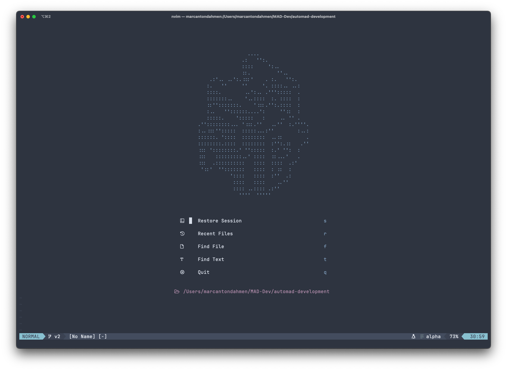

# Nvim Config




This is the personal NeoVim configuration of Marc Anton Dahmen.
It is based on [this YouTube tutorial](https://www.youtube.com/watch?v=vdn_pKJUda8)
and [this config](https://github.com/josean-dev/dev-environment-files/tree/main/.config/nvim).

## Included

This config includes the following items:

-   [Basic options](lua/marcantondahmen/core/options.lua)
-   [Keymaps](lua/marcantondahmen/core/keymaps.lua)
-   [Nord color scheme](https://github.com/shaunsingh/nord.nvim)
-   [Packer](https://github.com/wbthomason/packer.nvim)
-   [Nvim Tree](https://github.com/nvim-tree/nvim-tree.lua)
-   [Folding](lua/marcantondahmen/plugins/fold.lua)
-   [Auto Session](https://github.com/rmagatti/auto-session/)
-   [Navbuddy](https://github.com/SmiteshP/nvim-navbuddy)
-   [Icons](https://github.com/nvim-tree/nvim-web-devicons)
-   [Lualine](https://github.com/nvim-lualine/lualine.nvim)
-   [Tabline](https://github.com/kdheepak/tabline.nvim)
-   [ToggleTerm](https://github.com/akinsho/toggleterm.nvim)
-   [Script Runner](lua/telescope/_extensions/scripts.lua)
-   [Notify](https://github.com/rcarriga/nvim-notify)
-   [Spectre](https://github.com/nvim-pack/nvim-spectre)
-   [Alpha Dashboard](https://github.com/goolord/alpha-nvim)
-   [Gitui](lua/marcantondahmen/plugins/gitui.lua)
-   [diffview](https://github.com/sindrets/diffview.nvim)
-   [Telescope](https://github.com/nvim-telescope/telescope.nvim)
-   [tagalong](https://github.com/AndrewRadev/tagalong.vim)
-   [Autocompletion](https://github.com/hrsh7th/nvim-cmp)
-   [lspconfig](https://github.com/neovim/nvim-lspconfig)
-   [lspsaga](https://github.com/glepnir/lspsaga.nvim)
-   [Treesitter](https://github.com/nvim-treesitter/nvim-treesitter)
-   [null-ls, Prettier](https://github.com/jose-elias-alvarez/null-ls.nvim)
-   [trouble](https://github.com/folke/trouble.nvim)
-   [which-key](https://github.com/folke/which-key.nvim)
-   [autopairs](https://github.com/windwp/nvim-autopairs)
-   [Indent guides](https://github.com/lukas-reineke/indent-blankline.nvim)
-   [gitsigns](https://github.com/lewis6991/gitsigns.nvim)
-   [Vim surround](https://github.com/tpope/vim-surround)
-   [Replace with register](https://github.com/inkarkat/vim-ReplaceWithRegister)
-   [Vim maximizer](https://github.com/szw/vim-maximizer)
-   [Comment plugin](https://github.com/numToStr/Comment.nvim)
-   [Docblocks](https://github.com/kkoomen/vim-doge)

## Installation

Just clone the repository into the `~/.config` directory as follows:

```
git clone git@github.com:marcantondahmen/nvim-config.git ~/.config/nvim
```

Or using `https`:

```
git clone https://github.com/marcantondahmen/nvim-config.git ~/.config/nvim
```

### Dependencies

The following dependecies have to be installed in order to make all plugins work correctly:

-   ripgrep
-   fd
-   sed
-   wget
-   Python3 provider
-   node neovim package
-   unzip (probably only WSL)
-   PHP (for Composer)
-   Composer (for Psalm)
-   Gitui

In order to install the basic dependecies, assuming that [Gitui](https://github.com/extrawurst/gitui), PHP and Composer are installed anyways, run the following commands on macOS for example:

```bash
brew install ripgrep
brew install fd
brew install gnu-sed
brew install wget
python3 -m pip install --user --upgrade pynvim
npm install -g neovim
```

## Additional Resources

Here are some helpful links and resources in order to improve this config:

-   [LSP Servers](https://github.com/williamboman/mason-lspconfig.nvim#available-lsp-servers)

## Fonts

Good looking fonts that also works well with symbols are **JetBrainsMono Nerd Font** and **Hack Nerd Font** that can be downloaded [here](https://www.nerdfonts.com/font-downloads).
Note, that on **macOS**, nerd fonts can be installed using `brew`.
